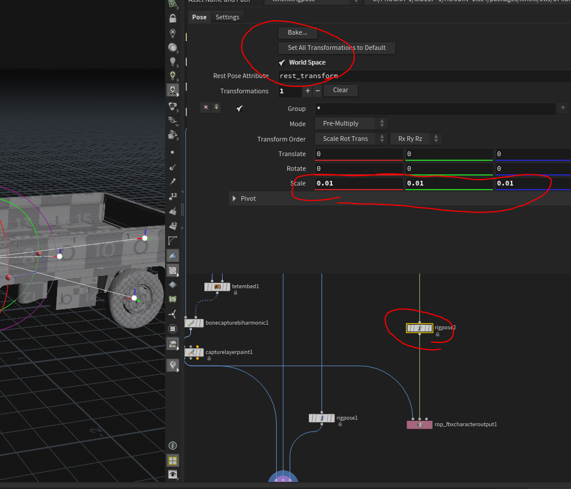

---
hide:
 - toc
 - path
 - title
---

Houdin Nerd [Site](https://abrupt-scarf-fb8.notion.site/HOUDINI-NERD-bb58e9354c434092abc04e63231745a9)

Houdini Dog Rig Project [Discussion](https://www.sidefx.com/forum/topic/76420/)

Houdini Rigging [Guide](https://www.riggingdojo.com/2020/10/28/sidefx-houdini-18-5-kinefx/)

Extra KineFX Tools [Github Repo](https://github.com/kamilhepner/kinefx_tools)

---

## Houdini-Unreal Skeleton Fix Scale
1. Add a rigpose
2. Set it to world transform and scaled everything to .01 before export
3. Disable import bone tracks in unreal fbx importer

---

## Retarget
- Lessons [Site](https://www.sidefx.com/tutorials/retarget-the-cmu-motion-capture-database-19_5/)

---

## Increase Viewport Performance

