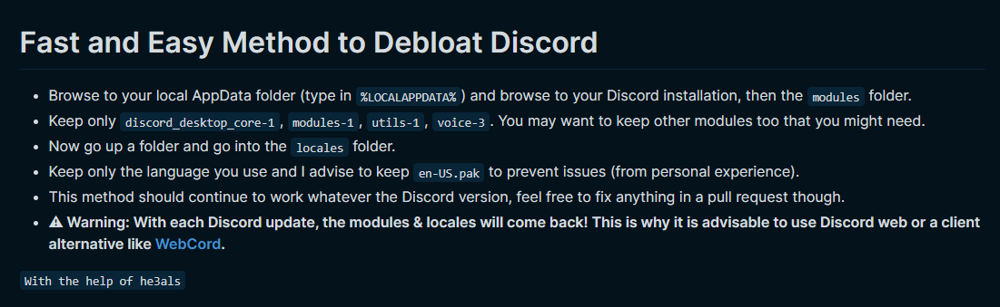

---
hide:
 - toc
 - path
 - title
---

## Debloat Discord 
Source: fernbacher



---

## Extra 

Use [OpenAsar](https://openasar.dev/)

<details>
  <summary>CSS Customization</summary>
  
```
/*Horizontal Server List*/
@import url('https://discordstyles.github.io/HorizontalServerList/dist/HorizontalServerList.css');

/*Clean Titlebar*/
@import url('https://discordstyles.github.io/Addons/windows-titlebar.css');

/* Hide Gift Button in chat box */
button[aria-label="Send a gift"] {
    display: none;
}
/* Hide Nitro Tab in Friends Menu */
.channel-1Shao0.container-32HW5s[aria-posinset="2"] {
    display: none;
}
/* hide nitro boost banner */
div.container-2giAcK[tabindex="0"] {
    display: none;
}
/* hide nitro boost banner */
div.container-2giAcK[tabindex="0"], div.container-2giAcK[tabindex="0"] + div {
    display: none;
}

/* Compact channels catégories */

:root {
    --category-spacing: 0px;
    --channel-spacing: 1px;
}

.containerDefault-3TQ5YN, .containerDragAfter-1J_-1V, .containerDragBefore-ei4h1m, .containerUserOver-3woq86 {
    padding-top: var(--category-spacing);
}

.mainContent-20q_Hp {
    padding: var(--channel-spacing);
}

/* Slidy Members */
[class*="membersWrap-"] [class*="membersGroup-"] {
    margin-right: auto;
    width: 57px;
    text-overflow: clip;
    direction: rtl;
    word-spacing: 1000px;
}
[class*="membersWrap-"]:hover [class*="membersGroup-"],
[class*="membersWrap-"]:focus-within [class*="membersGroup-"] {
    width: 100%;
    margin: 0;
    direction: ltr;
    word-spacing: unset;
    text-overflow: ellipsis;
}
.membersWrap-3NUR2t{
  min-width: 0 !important; 
}
.members-3WRCEx {
  transition: 250ms ease all;
  width: 64px !important; 
}
.members-3WRCEx:hover {
  width: 64px !important;
}
.membersWrap-3NUR2t:hover .members-3WRCEx{
  width: 245px !important;
}
/* Minified Search Bar */ 

:root {
    --transitionspeed: 0.01s;
}

.search-2Mwzzq:not(.open-1F8u2c) .searchBar-jGtisZ {width: 27px; transition: var(--transitionspeed); background-color: transparent;}
.search-2Mwzzq:not(.open-1F8u2c):hover .searchBar-jGtisZ {width: 170px; background-color: var(--background-tertiary);}
.search-2Mwzzq:not(.open-1F8u2c) .iconContainer-1RqWJj {transform: scale(1.3); transition: var(--transitionspeed);}
.search-2Mwzzq:not(.open-1F8u2c):hover .iconContainer-1RqWJj {transform: scale(1);}
.search-2Mwzzq:not(.open-1F8u2c) .icon-18rqoe {color: var(--text-normal);}
.search-2Mwzzq:not(.open-1F8u2c):hover .icon-18rqoe {color: var(--text-muted);}
/* Channel Names Capitalized */

.channelName-3KPsGw {
text-transform: capitalize;
}

/*Disable Animation*/

*{
  animation:none !important;
  transition:none !important;
}

circle[fill="white"]{
  opacity: 1!important;
}

.modal-3c3bKg[style*="transform: scale"],.popout-2iWAc-,.animating-rRxada{
  transform:none !important;
  opacity: 1!important;
}

.backdrop-1wrmKB{
  opacity: 1!important;
}
/*reactions*/
#app-mount .reaction-1ELvT8.reactionMe-23mbRf /*reacting to stuff*/{
    transform: none !important;
    opacity: 1 !important;
}
.reaction-1ELvT8.reactionMe-23mbRf .reactionCount-2ddRoS div[style*="position: absolute;"], .reactionCount-2ddRoS div[style*="position: absolute;"] {
    transform: none !important; /*reaction number - will look wonky for a split second*/
}
/*those dot things*/
#app-mount .dots-3Bkt3k circle[fill="white"] {
    opacity: 1 !important;
    r: 2;
}
/*popouts and the backdrop*/
#app-mount .inner-1ilYF7, .modal-3c3bKg /*popouts*/{
    transform: none !important;
    opacity: 1 !important;
}
#app-mount .backdrop-1wrmKB, .backdropWithLayer-3_uhz4 /*backdrop (background)*/ {
    transform: none !important;
    opacity: 0.8 !important;
}
/* Hide Public Servers Button */
[aria-label="Explore Public Servers"] {
display: none;
}
```
</details>

---
## Altenative Client

WebCord [🔗](https://github.com/SpacingBat3/WebCord)

Ripcord [🔗](https://cancel.fm/ripcord/)

